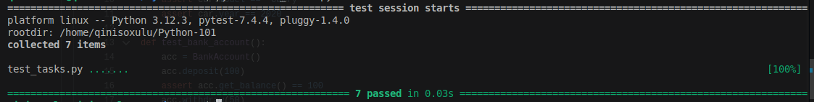

# Python Classes Project

Welcome to the Python Classes Project! This project focuses on **object-oriented programming (OOP)** concepts in Python, including classes, inheritance, methods, and more.

## Setup Instructions

### Step 1: Fork and Clone the Repository
1. **Fork the Repository**:  
   - Click the "Fork" button at the top right of this repository to create your copy.
2. **Clone Your Fork**:  
   ```bash
   git clone https://github.com/YOUR_USERNAME/Python-103.git
   cd Python-103
   ```

### Step 2: Set Up a Virtual Environment

**Create a Virtual Environment:**
```bash
python -m venv venv
```

**Activate the Environment:**

**Windows:**
```bash
venv\Scripts\activate
```

**macOS/Linux:**
```bash
source venv/bin/activate
```

**Install Dependencies:**
```bash
pip install -r requirements.txt
```

### Step 3: Complete the Tasks

**Implement Solutions:**
- Open `tasks.py` and complete all 10 tasks related to classes.

**Run Tests:**
```bash
pytest test_tasks.py
```

**If all your tests pass, you should see this on the terminal:**


### Step 4: Submit Your Work

**Commit and Push:**
```bash
git add tasks.py
git commit -m "Completed class tasks"
git push origin main
```

**Open a Pull Request:**
- Go to your forked repository on GitHub and submit a pull request to your branch name from the main repository.

## Tasks Overview

1. **Vehicle Class**: Basic class with attributes.
2. **BankAccount Class**: Methods for deposits, withdrawals, and balance checks.
3. **Inheritance**: Override a method in a subclass.
4. **Class Methods**: Create a student from a string.
5. **Static Methods**: Implement math operations.
6. **Properties**: Temperature conversion between Celsius and Fahrenheit.
7. **Operator Overloading**: Add two vectors.
8. **Exception Handling**: Validate book title/author.
9. **Mixin Class**: JSON serialization.
10. **Abstract Class**: Implement shape methods.

## Need Help?

If you encounter issues, feel free to ask for assistance. Happy coding! 🚀

